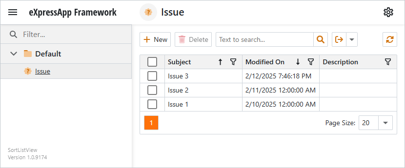

<!-- default badges list -->
[](https://supportcenter.devexpress.com/ticket/details/E1276)
[](https://docs.devexpress.com/GeneralInformation/403183)
[](#does-this-example-address-your-development-requirementsobjectives)
<!-- default badges end -->

# XAF - How to sort a ListView in code

This example sorts list view data by a class property and prevents users from modifying the sorting settings.



## Implementation Details

Create a View Controller in the Module project and use the ColumnsListEditor API to configure sorting settings for the List View columns:

_File to review:_ [SortListViewController.cs](CS/EFCore/SortListViewEF/SortListViewEF.Module/Controllers/SortListViewController.cs) 

```cs
    public class SortListViewController : ObjectViewController<ListView, Issue> {
        
        string propertyName = nameof(Issue.ModifiedOn);
        bool demoFlag = true;
        
        protected override void OnActivated() 
        {
            base.OnActivated();
            if (!demoFlag && View.Model.Sorting[propertyName] == null)
            {
                // This code applies a server side sorting.
                IModelSortProperty sortProperty = View.Model.Sorting.AddNode<IModelSortProperty>(propertyName);
                sortProperty.Direction = SortingDirection.Ascending;
                sortProperty.PropertyName = propertyName;
            }
        }

        protected override void OnViewControlsCreated()
        {
            base.OnViewControlsCreated();
            if (View.Editor is ColumnsListEditor listEditor)
            {
                foreach (var columnWrapper in listEditor.Columns)
                {
                    columnWrapper.AllowSortingChange = false;
                    // This code applies a client side sorting.
                    if (demoFlag && columnWrapper.PropertyName == propertyName)
                    {
                        columnWrapper.SortIndex = 0;
                        columnWrapper.SortOrder = ColumnSortOrder.Descending;
                    }
                }
            }
        }
    }
```

## Approach using platform-dependent API:
### Blazor: 

```cs
    protected override void OnViewControlsCreated()
    {
        base.OnViewControlsCreated();
        if(View.Editor is DxGridListEditor gridListEditor)
        {
            foreach (DxGridColumnWrapper column in gridListEditor.Columns)
            {
                column.AllowSortingChange = false;
            }
        }
    }
```

### Win: 

```cs
    protected override void OnViewControlsCreated()
    {
        base.OnViewControlsCreated();
        if(View.Editor is GridListEditor gridListEditor && gridListEditor.GridView != null)
        {
            foreach(WinGridColumnWrapper columnWrapper in gridListEditor.Columns)
            {
                columnWrapper.Column.OptionsColumn.AllowSort = DevExpress.Utils.DefaultBoolean.False;
                columnWrapper.Column.OptionsColumn.AllowGroup = DevExpress.Utils.DefaultBoolean.False;
            }
        }
    }
```

## Documentation 

- [Application Model (UI Settings Storage)](https://docs.devexpress.com/eXpressAppFramework/112579/ui-construction/application-model-ui-settings-storage)
- [Read and Set Values for Built-in Application Model Nodes in Code](https://docs.devexpress.com/eXpressAppFramework/112810/ui-construction/application-model-ui-settings-storage/customize-application-model-in-code/access-the-application-model-in-code)
- [How to: Access the Grid Component in a List View](https://docs.devexpress.com/eXpressAppFramework/402154/ui-construction/list-editors/how-to-access-list-editor-control)

## Files to Review

- [SortListViewController.cs](CS/EFCore/SortListViewEF/SortListViewEF.Module/Controllers/SortListViewController.cs)


<!-- feedback -->
## Does this example address your development requirements/objectives?

[](https://www.devexpress.com/support/examples/survey.xml?utm_source=github&utm_campaign=xaf-how-to-sort-a-listview-in-code&~~~was_helpful=yes) [](https://www.devexpress.com/support/examples/survey.xml?utm_source=github&utm_campaign=xaf-how-to-sort-a-listview-in-code&~~~was_helpful=no)

(you will be redirected to DevExpress.com to submit your response)
<!-- feedback end -->


